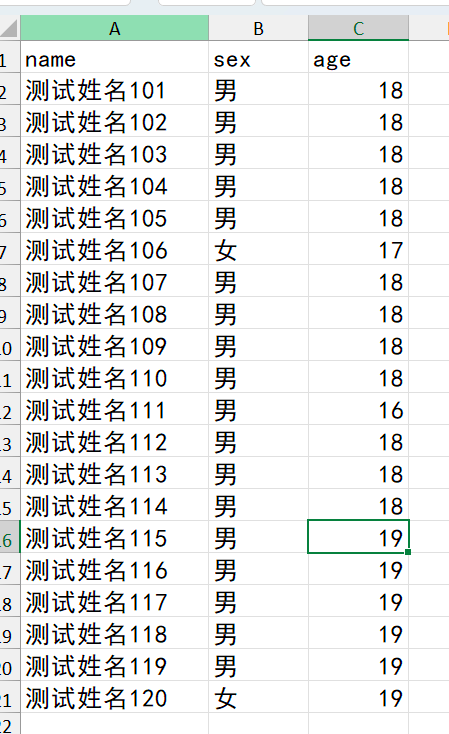
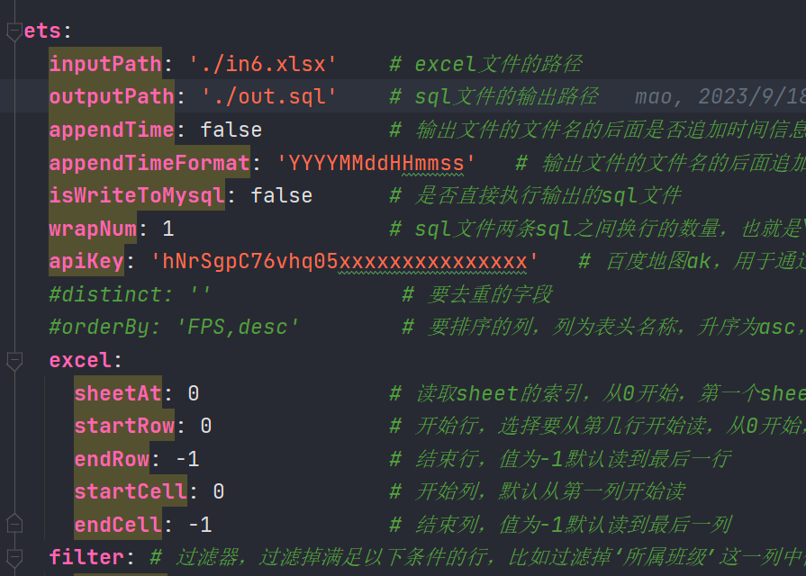
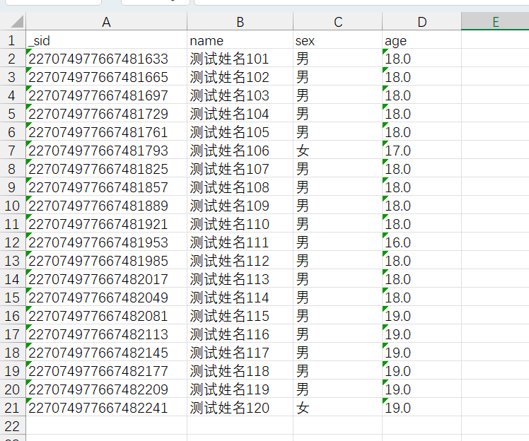

# excel to sql text

##  介绍


本程序用于将Excel文件里的数据转换成sql脚本，并选择执行!
通过自定义模板来生成想要的sql语句

提示：

1. 模板使用freemacker模板引擎实现，变量使用'${表头列名称}'格式来替换
2. freemacker支持加减乘除运算、条件语句、类型转换等，使用方法自行百度
3. 如果表头包含空格，写法'${.vars['CPU Temp']'
4. 数值类型会有逗号，可以使用类型转换，示例：'${(_index?number*2+100000)?c}'
5. 程序包含内置参数'_index'，可以直接使用，从0开始
6. excel的日期类型统一转换成时间戳，想要格式化的时间，可以写成'${Time?number?number_to_datetime?string('yyyy-MM-dd HH:mm:ss')}'
7. 对于excel中性别字段为男或女，但是数据库为0或1的，可以使用if else解决，示例：'insert into student values(${年龄},<#if 性别=='男'>0</#if><#if 性别=='女'>1</#if>)'
8. 数据库配置位于 druid.properties 文件里
9. 如果直接想要使用默认的模板，可以直接按回车即可，使用默认模板时，excel里的表头列名称要满足数据库规范
10. 程序通过配置属性类读取配置，配置文件示例如下，可以通过修改application.yml来修改配置，也可以通过参数传递来让配置临时生效
11. 如果需要对数据进行加工处理，可以实现ExcelDataHandler或者SqlDataHandler接口来处理excel或者sql数据，可以参考AddressToGeoExcelDataHandler


## 配置示例

配置位于`application.yml`文件

```yaml

ets:
  inputPath: './in6.xlsx'    # excel文件的路径
  outputPath: './out.sql'    # sql文件的输出路径
  appendTime: false          # 输出文件的文件名的后面是否追加时间信息
  appendTimeFormat: 'YYYYMMddHHmmss'   # 输出文件的文件名的后面追加时间信息的格式
  isWriteToMysql: false      # 是否直接执行输出的sql文件
  wrapNum: 1                 # sql文件两条sql之间换行的数量，也就是\n的个数
  apiKey: 'hNrSgpC76vhq05xxxxxxxxxxxxxxx'   # 百度地图ak，用于通过详细地址生成经纬度信息
  #distinct: ''               # 要去重的字段
  #orderBy: 'FPS,desc'        # 要排序的列，列为表头名称，升序为asc，降序为desc，按姓名降序：'姓名,desc'，按成绩升序：'成绩,asc'
  excel:
    sheetAt: 0               # 读取sheet的索引，从0开始，第一个sheet就是0，第二个sheet就是1
    startRow: 0              # 开始行，选择要从第几行开始读，从0开始，开始行必须为表头，从第4行开始就是3
    endRow: -1               # 结束行，值为-1默认读到最后一行
    startCell: 0             # 开始列，默认从第一列开始读
    endCell: -1              # 结束列，值为-1默认读到最后一列
  filter: # 过滤器，过滤掉满足以下条件的行，比如过滤掉‘所属班级’这一列中值为100001的行、过滤‘编码’字段值为‘Noinfo’、‘NotOnly’或者‘N000004-446-1151’的行
    "[编码]": [ 'Noinfo','NotOnly','N000004-446-1151' ]
    "[所属班级]": [ '100001' ]
    "[联系电话]": [ '' ]
  handler:                   # 处理器
    excelDataHandler:        # excel数据处理器
      ignoreRowExcelDataHandler:  # 忽略行excel数据处理器，filter为此处理器的配置项
        enable: true              # 是否启用此处理器
        order: 0                  # 执行的优先级，数字越低，优先级越高，越先执行
      distinctExcelDataHandler:   # 字段去重excel数据处理器，distinct为此处理器的配置项
        enable: true
        order: 1
      orderByExcelDataHandler:    # 字段排序excel数据处理器，orderBy为此处理器的配置项
        enable: true
        order: 2
      snowflakeIdExcelDataHandler: # 雪花算法ID生成excel数据处理器，filedName和machineCode为此处理器的配置项
        enable: true
        order: 8
        filedName: '_sid'       # 生成的雪花算法ID列的列名称，默认为_sid
        machineCode: 1          # 雪花算法的机器码，取值为0-31
      addressToGeoExcelDataHandler: # 详细地址转经纬度excel数据处理器，filedName为此处理器的配置项
        enable: true
        order: 20
        filedName: 'address'       # 详细地址字段名称
      passwordEncoderExcelDataHandler: # 密码加密excel数据处理器
        enable: false
        order: 31
        filedName: 'password'       # 密码字段在表头里的名称，默认为password
        algorithm: 'BCrypt'         # 密码加密算法，默认为BCrypt，目前支持BCrypt、MD5、SHA1、SHA256算法，区分大小写
        isAllTypeEncoder: true   # 是否加密密码字段，如果为true，则生成所有加密算法的加密字符串，如果为false，则生成algorithm配置对应的加密字符串
      passwordVerificationExcelDataHandler: # 密码校验excel数据处理器
        enable: false
        order: 32
        passwordFiledName: 'password'       # 密码字段在表头里的名称，默认为password
        encoderPasswordFiledName: 'password_BCrypt'  # 加密后密码字段在表头里的名称，默认为password_BCrypt
        verificationResultFiledName: 'passwordVerificationResult'    # 校验输出结果的字段名称，默认为passwordVerificationResult
        algorithm: 'BCrypt'         # 密码加密算法，默认为BCrypt，目前支持BCrypt、MD5、SHA1、SHA256算法，区分大小写
      printExcelDataHandler:      # 数据打印excel数据处理器
        enable: true
        order: 9998
      saveExcelDataHandler:       # 保存excel数据处理器
        enable: true
        order: 9999
    sqlDataHandler:           # sql数据处理器
      transitionSqlDataHandler: # 事务sql数据处理器
        enable: true
        order: 10
      printSqlDataHandler:     # 数据打印sql数据处理器
        enable: true
        order: 9998
```


## 使用

使用maven打包项目，生成jar包：
```shell
mvn package 
```

可选择使用参数`-DskipTests=true`跳过测试


生成的文件位于target目录


运行jar包：
```shell
java -jar xxx.jar
```


## handler

有两类处理器
* ExcelDataHandler
* SqlDataHandler

可以实现这两个接口的其中一个接口来对数据进行加工和过滤处理


示例

### AddressToGeoExcelDataHandler

```java
package mao.excel_to_sql_test.handler;

import mao.excel_to_sql_test.entity.ExcelData;
import mao.excel_to_sql_test.entity.Geo;
import mao.excel_to_sql_test.handler.impl.DistinctExcelDataHandler;
import mao.excel_to_sql_test.service.AddressToGeoService;
import org.slf4j.Logger;
import org.slf4j.LoggerFactory;
import org.springframework.beans.factory.annotation.Autowired;
import org.springframework.beans.factory.annotation.Value;
import org.springframework.stereotype.Component;

import java.util.List;
import java.util.Map;

/**
 * Project name(项目名称)：excel-to-sqltest
 * Package(包名): mao.excel_to_sql_test.handler
 * Class(类名): AddressToGeoExcelDataHandler
 * Author(作者）: mao
 * Author QQ：1296193245
 * GitHub：https://github.com/maomao124/
 * Date(创建日期)： 2023/10/7
 * Time(创建时间)： 11:33
 * Version(版本): 1.0
 * Description(描述)： 详细地址转经纬度excel数据处理器
 */

@Component
public class AddressToGeoExcelDataHandler implements ExcelDataHandler
{

    private static final Logger log = LoggerFactory.getLogger(DistinctExcelDataHandler.class);


    @Autowired
    private AddressToGeoService addressToGeoService;

    /**
     * 是否启用此handler，从配置文件里读取
     */
    @Value("${ets.handler.excelDataHandler.addressToGeoExcelDataHandler.enable:true}")
    private boolean enable;

    /**
     * 此handler的优先级，从配置文件里读取
     */
    @Value("${ets.handler.excelDataHandler.addressToGeoExcelDataHandler.order:20}")
    private int order;

    /**
     * 详细地址在表头里的名称，默认为address
     */
    @Value("${ets.handler.excelDataHandler.addressToGeoExcelDataHandler.filedName:address}")
    private String filedName;


    @Override
    public boolean enabled()
    {
        return enable;
    }

    @Override
    public int getOrder()
    {
        return order;
    }

    @Override
    public String getName()
    {
        return "详细地址转经纬度excel数据处理器";
    }

    @Override
    public void handler(ExcelData excelData)
    {
        if (!excelData.getTitles().contains(filedName))
        {
            //没有详细地址字段
            log.info("没有详细地址字段\"" + filedName + "\"，跳过执行");
            return;
        }
        List<String> titles = excelData.getTitles();
        List<Map<String, String>> content = excelData.getContent();
        if (titles.contains("longitude") || titles.contains("latitude"))
        {
            log.warn("字段冲突! 已存在字段longitude或者latitude，跳过执行");
            return;
        }
        try
        {
            log.info("开始向百度地图服务发起请求");
            int index = 0;
            for (Map<String, String> rowMap : content)
            {
                String address = rowMap.get(filedName);
                index++;
                if (address == null || address.equals(""))
                {
                    log.info("跳过" + index);
                    continue;
                }
                //转换
                Geo geo = addressToGeoService.addressToGeo(address);
                log.info("已完成：" + index + "/" + rowMap.size() + " ，结果：" + geo);
                rowMap.put("longitude", geo.getLongitude().toString());
                rowMap.put("latitude", geo.getLatitude().toString());
                rowMap.put("precise", geo.getPrecise().toString());
                rowMap.put("confidence", geo.getConfidence().toString());
                rowMap.put("comprehension", geo.getComprehension().toString());
                rowMap.put("level", geo.getLevel());
            }
            log.info("请求完成");
            //设置表头
            titles.add("longitude");
            titles.add("latitude");
            titles.add("precise");
            titles.add("confidence");
            titles.add("comprehension");
            titles.add("level");
        }
        catch (Exception e)
        {
            log.error("执行详细地址转经纬度excel数据处理器时发生错误：", e);
        }
    }
}

```


### IgnoreRowExcelDataHandler

```java
package mao.excel_to_sql_test.handler;

import mao.excel_to_sql_test.config.BaseConfigurationProperties;
import mao.excel_to_sql_test.entity.ExcelData;
import mao.excel_to_sql_test.handler.impl.DistinctExcelDataHandler;
import org.slf4j.Logger;
import org.slf4j.LoggerFactory;
import org.springframework.beans.factory.annotation.Autowired;
import org.springframework.beans.factory.annotation.Value;
import org.springframework.stereotype.Component;

import java.util.ArrayList;
import java.util.List;
import java.util.Map;
import java.util.concurrent.atomic.AtomicBoolean;

/**
 * Project name(项目名称)：excel-to-sqltest
 * Package(包名): mao.excel_to_sql_test.handler
 * Class(类名): IgnoreRowExcelDataHandler
 * Author(作者）: mao
 * Author QQ：1296193245
 * GitHub：https://github.com/maomao124/
 * Date(创建日期)： 2023/10/7
 * Time(创建时间)： 9:20
 * Version(版本): 1.0
 * Description(描述)： 忽略行excel数据处理器
 */

@Component
public class IgnoreRowExcelDataHandler implements ExcelDataHandler
{

    private static final Logger log = LoggerFactory.getLogger(DistinctExcelDataHandler.class);

    @Autowired
    private BaseConfigurationProperties baseConfigurationProperties;

    /**
     * 是否启用此handler，从配置文件里读取
     */
    @Value("${ets.handler.excelDataHandler.ignoreRowExcelDataHandler.enable:true}")
    private boolean enable;

    /**
     * 此handler的优先级，从配置文件里读取
     */
    @Value("${ets.handler.excelDataHandler.ignoreRowExcelDataHandler.order:0}")
    private int order;

    @Override
    public boolean enabled()
    {
        return enable;
    }

    @Override
    public int getOrder()
    {
        return order;
    }

    @Override
    public String getName()
    {
        return "忽略行excel数据处理器";
    }

    @Override
    public void handler(ExcelData excelData)
    {
        List<Map<String, String>> content = excelData.getContent();
        try
        {
            List<Map<String, String>> contentNew = new ArrayList<>();
            for (int i = 0; i < content.size(); i++)
            {
                Map<String, String> rowMap = content.get(i);
                if (isIgnore(rowMap))
                {
                    //忽略
                    log.info("忽略第" + (i + 1) + "行数据：" + rowMap);
                }
                else
                {
                    //log.debug("第" + (i + 1) + "行数据：" + rowMap);
                    contentNew.add(rowMap);
                }
            }
            excelData.setContent(contentNew);
        }
        catch (Exception e)
        {
            log.error("执行忽略行excel数据处理器时出现问题：", e);
        }
    }


    /**
     * 是否忽略当前行
     *
     * @param rowMap 行数据
     * @return boolean 要忽略为是
     */
    private boolean isIgnore(Map<String, String> rowMap)
    {
        Map<String, List<String>> filter = baseConfigurationProperties.getFilter();
        AtomicBoolean isIgnore = new AtomicBoolean(false);
        rowMap.forEach((title, value) ->
        {
            //判断该列的表头是否在过滤列表里
            if (filter.get(title) == null)
            {
                //不在过滤列表，直接下一个
                return;
            }
            //表头在过滤列表里
            List<String> list = filter.get(title);
            for (String s : list)
            {
                if (s.equals(value))
                {
                    isIgnore.set(true);
                    return;
                }
            }
        });
        return isIgnore.get();
    }
}

```


### SnowflakeIdExcelDataHandler

```java
package mao.excel_to_sql_test.handler.impl;

import mao.excel_to_sql_test.entity.ExcelData;
import mao.excel_to_sql_test.handler.ExcelDataHandler;
import mao.excel_to_sql_test.utils.id.SnowflakeIdGenerate;
import org.slf4j.Logger;
import org.slf4j.LoggerFactory;
import org.springframework.beans.factory.annotation.Value;
import org.springframework.stereotype.Service;

import java.util.List;
import java.util.Map;

/**
 * Project name(项目名称)：excel-to-sqltest
 * Package(包名): mao.excel_to_sql_test.handler
 * Class(类名): SnowflakeIdExcelDataHandler
 * Author(作者）: mao
 * Author QQ：1296193245
 * GitHub：https://github.com/maomao124/
 * Date(创建日期)： 2023/10/12
 * Time(创建时间)： 9:49
 * Version(版本): 1.0
 * Description(描述)： 雪花算法ID生成excel数据处理器
 */

@Service
public class SnowflakeIdExcelDataHandler implements ExcelDataHandler
{

    private static final Logger log = LoggerFactory.getLogger(PasswordEncoderExcelDataHandler.class);


    /**
     * 是否启用此handler，从配置文件里读取
     */
    @Value("${ets.handler.excelDataHandler.snowflakeIdExcelDataHandler.enable:true}")
    private boolean enable;

    /**
     * 此handler的优先级，从配置文件里读取
     */
    @Value("${ets.handler.excelDataHandler.snowflakeIdExcelDataHandler.order:8}")
    private int order;

    /**
     * 生成的雪花算法ID列的列名称，默认为_sid
     */
    @Value("${ets.handler.excelDataHandler.snowflakeIdExcelDataHandler.filedName:_sid}")
    private String filedName;

    /**
     * 雪花算法的机器码，取值为0-31
     */
    @Value("${ets.handler.excelDataHandler.snowflakeIdExcelDataHandler.machineCode:1}")
    private long machineCode;

    @Override
    public boolean enabled()
    {
        return enable;
    }

    @Override
    public int getOrder()
    {
        return order;
    }

    @Override
    public String getName()
    {
        return "雪花算法ID生成excel数据处理器";
    }

    @Override
    public void handler(ExcelData excelData)
    {
        SnowflakeIdGenerate snowflakeIdGenerate = new SnowflakeIdGenerate(machineCode);
        log.debug("机器码：" + machineCode);
        List<Map<String, String>> content = excelData.getContent();
        List<String> titles = excelData.getTitles();
        for (Map<String, String> rowMap : content)
        {
            rowMap.put(filedName, snowflakeIdGenerate.generate().toString());
        }
        //设置表头
        titles.add(0, filedName);
    }
}

```


## 模板示例

```sql
insert into student values(${年龄},
<#if 性别=='男'>0</#if><#if 性别=='女'>1</#if>)
```


```sql
INSERT INTO `th_db`.`car_arrange_line` (`collector_user_id`, 
`collector_user_name`, `line_name`, `collector_car_name`, `line_phone`, 
`add_userid`, `add_date`, `modify_userid`, `modify_date`, `tenant_id`, 
`collector_car_id`, `car_arrange_id`, `collection_line_id`,
 `car_arrange_line_id`, `daily_count`, `api_map_id`, `high_speed`, `down_date`, `up_date`, 
`memo`, `line_time`)
 VALUES (NULL, '${司机}', NULL, '${车牌号}', 
'${联系电话?number?c}', NULL, '2023-09-19 00:00:00', NULL, NULL, 
'N000017', 'gzepi22091607', 
(select car_arrange_id FROM car_arrange WHERE
 year='${日期?number?number_to_datetime?string('yyyy-MM-dd HH:mm:ss')}' 
AND dept_name='白云车队'),
 NULL, 'bycd00${(_index?number+205)?c}', 0, NULL, NULL, NULL, NULL,
 '白云车队·', '${收运时间段}');
```


```sql

update sys_user set birth_date=CONCAT(SUBSTR(id_code,7,4),
'-',SUBSTR(id_code,11,2),'-',SUBSTR(id_code,13,2)),
user_type='<#if 岗位类型=='前端保洁工'>sanitation</#if>
<#if 岗位类型=='驾驶员'>sj</#if><#if 岗位类型=='司乘'>sc</#if>
<#if 岗位类型=='汽车维修工'>check</#if><#if 岗位类型=='勤杂人员'>qinza</#if>
<#if 岗位类型=='管理人员'>gl</#if><#if 岗位类型=='其他'>other</#if>
<#if 岗位类型=='压缩站操作工'>zzz</#if>'
 where user_id='${(_index?number+202210120346)?c}';

```


```sql

insert into annual_contract_son (contract_son_id,contract_id,
cartract_number,son_name,efficient,price,contract_unit,add_date,add_userid,tenant_id) 
values('${_sid}','N000017-644-102','${序号}','${名称}','${规格}',${价格},'${单位}',
now(),'N000017-418-1','N000017');

```

```sql

insert into sys_user 
(user_id,user_code,tenant_id,add_date,phone_code,
user_name,id_code,sex,nation,politics,linkman_phone,
address,dept_name,dept_id,pory_type,entry_date,contract_limit,driver_code,
native_place,household_registration,now_address,date_this_unit,
subject_name,contract_start_time,contract_end_time,sign_contract_number,
auditing) values('${(_index?number+202210120346)?c}','${联系电话?number?c}',
'N000017',NOW(),'${联系电话?number?c}','${姓名}','${身份证号码}','
<#if 性别=='男'>1</#if><#if 性别=='女'>0</#if>','${民族}',
'<#if 政治面貌=='群众'>3</#if><#if 政治面貌=='共青团员'>2</#if><#if 政治面貌=='中共党员'>
1</#if><#if 政治面貌=='无党派人士'>4</#if><#if 政治面貌=='民主党派'>5</#if>',
'${联系电话?number?c}','${户籍地址}','雷州项目',
(select dept_id from sys_dept where dept_name='雷州项目'),
'${岗位类型}','${入职日期?number?number_to_datetime?string('yyyy/MM/dd')}',
'${合同期限?number?number_to_datetime?string('yyyy/MM/dd')}','${驾驶证件号}',
'${籍贯}','<#if 户籍=='本地城镇'>1</#if><#if 户籍=='本地农村'>2</#if><#if 户籍=='外地城镇'>3</#if>
<#if 户籍=='外地农村'>4</#if>','${现住地址}',
'${到本单位日期?number?number_to_datetime?string('yyyy/MM/dd')}',
'${合同主体}','${合同开始日期?number?number_to_datetime?string('yyyy/MM/dd')}',
'${合同结束日期?number?number_to_datetime?string('yyyy/MM/dd')}',
'${第几次签合同?number}','1');

```


## 入门示例

**第一步：**准备表格

假设有如下表格：




表格名称为in6.xlsx，位于项目根路径下


**第二步：**在项目的application.yml配置文件中配置文件输入路径、文件输出路径等，可以为绝对路径，也可以为相对路径




**第三步：**启动项目


```sh
    .   ____          _            __ _ _
   /\\ / ___'_ __ _ _(_)_ __  __ _ \ \ \ \
  ( ( )\___ | '_ | '_| | '_ \/ _` | \ \ \ \
   \\/  ___)| |_)| | | | | || (_| |  ) ) ) )
    '  |____| .__|_| |_|_| |_\__, | / / / /
   =========|_|==============|___/=/_/_/_/
   :: Spring Boot ::                (v2.7.1)

            _____                    _____                   _______
           /\    \                  /\    \                 /::\    \
          /::\____\                /::\    \               /::::\    \
         /::::|   |               /::::\    \             /::::::\    \
        /:::::|   |              /::::::\    \           /::::::::\    \
       /::::::|   |             /:::/\:::\    \         /:::/~~\:::\    \
      /:::/|::|   |            /:::/__\:::\    \       /:::/    \:::\    \
     /:::/ |::|   |           /::::\   \:::\    \     /:::/    / \:::\    \
    /:::/  |::|___|______    /::::::\   \:::\    \   /:::/____/   \:::\____\
   /:::/   |::::::::\    \  /:::/\:::\   \:::\    \ |:::|    |     |:::|    |
  /:::/    |:::::::::\____\/:::/  \:::\   \:::\____\|:::|____|     |:::|    |
  \::/    / ~~~~~/:::/    /\::/    \:::\  /:::/    / \:::\    \   /:::/    /
   \/____/      /:::/    /  \/____/ \:::\/:::/    /   \:::\    \ /:::/    /
               /:::/    /            \::::::/    /     \:::\    /:::/    /
              /:::/    /              \::::/    /       \:::\__/:::/    /
             /:::/    /               /:::/    /         \::::::::/    /
            /:::/    /               /:::/    /           \::::::/    /
           /:::/    /               /:::/    /             \::::/    /
          /:::/    /               /:::/    /               \::/____/
          \::/    /                \::/    /                 ~~
           \/____/                  \/____/
   :: Github (https://github.com/maomao124) ::

2023-10-20 15:35:54.113  INFO 45888 --- [           main] m.e.ExcelToSqltestApplication            : Starting ExcelToSqltestApplication using Java 17.0.8.1 on mao with PID 45888 (D:\程序\2023Q3\excel-to-sqltest\target\classes started by mao in D:\程序\2023Q3\excel-to-sqltest)
2023-10-20 15:35:54.114 DEBUG 45888 --- [           main] m.e.ExcelToSqltestApplication            : Running with Spring Boot v2.7.1, Spring v5.3.21
2023-10-20 15:35:54.114  INFO 45888 --- [           main] m.e.ExcelToSqltestApplication            : No active profile set, falling back to 1 default profile: "default"
2023-10-20 15:35:54.297  INFO 45888 --- [           main] m.e.config.DataSourceConfig              : 初始化 DataSourceConfig
2023-10-20 15:35:54.372  INFO 45888 --- [           main] m.e.ExcelToSqltestApplication            : Started ExcelToSqltestApplication in 0.437 seconds (JVM running for 0.689)
2023-10-20 15:35:54.374  INFO 45888 --- [           main] m.e.service.impl.RunServiceImpl          : 


本程序用于将Excel文件里的数据转换成sql脚本，并选择执行!
通过自定义模板来生成想要的sql语句
1. 模板使用freemacker模板引擎实现，变量使用'${表头列名称}'格式来替换
2. freemacker支持加减乘除运算、条件语句、类型转换等，使用方法自行百度
3. 如果表头包含空格，写法'${.vars['CPU Temp']'
4. 数值类型会有逗号，可以使用类型转换，示例：'${(_index?number*2+100000)?c}'
5. 程序包含内置参数'_index'，可以直接使用，从0开始
6. excel的日期类型统一转换成时间戳，想要格式化的时间，可以写成'${Time?number?number_to_datetime?string('yyyy-MM-dd HH:mm:ss')}'
7. 对于excel中性别字段为男或女，但是数据库为0或1的，可以使用if else解决，示例：'insert into student values(${年龄},<#if 性别=='男'>0</#if><#if 性别=='女'>1</#if>)'
8. 数据库配置位于 druid.properties 文件里
9. 如果直接想要使用默认的模板，可以直接按回车即可，使用默认模板时，excel里的表头列名称要满足数据库规范
10.程序通过配置属性类读取配置，配置文件示例如下，可以通过修改application.yml来修改配置，也可以通过参数传递来让配置临时生效
11.如果需要对数据进行加工处理，可以实现ExcelDataHandler或者SqlDataHandler接口来处理excel或者sql数据，可以参考AddressToGeoExcelDataHandler


ets:
  inputPath: './in6.xlsx'    # excel文件的路径
  outputPath: './out.sql'    # sql文件的输出路径
  appendTime: false          # 输出文件的文件名的后面是否追加时间信息
  appendTimeFormat: 'YYYYMMddHHmmss'   # 输出文件的文件名的后面追加时间信息的格式
  isWriteToMysql: false      # 是否直接执行输出的sql文件
  wrapNum: 1                 # sql文件两条sql之间换行的数量，也就是\n的个数
  apiKey: 'hNrSgpC76vhq05xxxxxxxxxxxxxxx'   # 百度地图ak，用于通过详细地址生成经纬度信息
  #distinct: ''               # 要去重的字段
  #orderBy: 'FPS,desc'        # 要排序的列，列为表头名称，升序为asc，降序为desc，按姓名降序：'姓名,desc'，按成绩升序：'成绩,asc'
  excel:
    sheetAt: 0               # 读取sheet的索引，从0开始，第一个sheet就是0，第二个sheet就是1
    startRow: 0              # 开始行，选择要从第几行开始读，从0开始，开始行必须为表头，从第4行开始就是3
    endRow: -1               # 结束行，值为-1默认读到最后一行
    startCell: 0             # 开始列，默认从第一列开始读
    endCell: -1              # 结束列，值为-1默认读到最后一列
  filter: # 过滤器，过滤掉满足以下条件的行，比如过滤掉‘所属班级’这一列中值为100001的行、过滤‘编码’字段值为‘Noinfo’、‘NotOnly’或者‘N000004-446-1151’的行
    "[编码]": [ 'Noinfo','NotOnly','N000004-446-1151' ]
    "[所属班级]": [ '100001' ]
    "[联系电话]": [ '' ]
  handler:                   # 处理器
    excelDataHandler:        # excel数据处理器
      ignoreRowExcelDataHandler:  # 忽略行excel数据处理器，filter为此处理器的配置项
        enable: true              # 是否启用此处理器
        order: 0                  # 执行的优先级，数字越低，优先级越高，越先执行
      distinctExcelDataHandler:   # 字段去重excel数据处理器，distinct为此处理器的配置项
        enable: true
        order: 1
      orderByExcelDataHandler:    # 字段排序excel数据处理器，orderBy为此处理器的配置项
        enable: true
        order: 2
      snowflakeIdExcelDataHandler: # 雪花算法ID生成excel数据处理器，filedName和machineCode为此处理器的配置项
        enable: true
        order: 8
        filedName: '_sid'       # 生成的雪花算法ID列的列名称，默认为_sid
        machineCode: 1          # 雪花算法的机器码，取值为0-31
      addressToGeoExcelDataHandler: # 详细地址转经纬度excel数据处理器，filedName为此处理器的配置项
        enable: true
        order: 20
        filedName: 'address'       # 详细地址字段名称
      passwordEncoderExcelDataHandler: # 密码加密excel数据处理器
        enable: false
        order: 31
        filedName: 'password'       # 密码字段在表头里的名称，默认为password
        algorithm: 'BCrypt'         # 密码加密算法，默认为BCrypt，目前支持BCrypt、MD5、SHA1、SHA256算法，区分大小写
        isAllTypeEncoder: true   # 是否加密密码字段，如果为true，则生成所有加密算法的加密字符串，如果为false，则生成algorithm配置对应的加密字符串
      passwordVerificationExcelDataHandler: # 密码校验excel数据处理器
        enable: false
        order: 32
        passwordFiledName: 'password'       # 密码字段在表头里的名称，默认为password
        encoderPasswordFiledName: 'password_BCrypt'  # 加密后密码字段在表头里的名称，默认为password_BCrypt
        verificationResultFiledName: 'passwordVerificationResult'    # 校验输出结果的字段名称，默认为passwordVerificationResult
        algorithm: 'BCrypt'         # 密码加密算法，默认为BCrypt，目前支持BCrypt、MD5、SHA1、SHA256算法，区分大小写
      printExcelDataHandler:      # 数据打印excel数据处理器
        enable: true
        order: 9998
      saveExcelDataHandler:       # 保存excel数据处理器
        enable: true
        order: 9999
    sqlDataHandler:           # sql数据处理器
      transitionSqlDataHandler: # 事务sql数据处理器
        enable: true
        order: 10
      printSqlDataHandler:     # 数据打印sql数据处理器
        enable: true
        order: 9998


2023-10-20 15:35:54.374  INFO 45888 --- [           main] m.e.service.impl.RunServiceImpl          : excel文件位置：./in6.xlsx
2023-10-20 15:35:54.374  INFO 45888 --- [           main] m.e.service.impl.RunServiceImpl          : sql文件输出位置：./out.sql
2023-10-20 15:35:54.374  INFO 45888 --- [           main] m.e.service.impl.RunServiceImpl          : 模板日志输出位置：./template.log
2023-10-20 15:35:54.374  INFO 45888 --- [           main] m.e.service.impl.RunServiceImpl          : SQL之间换行数量：1
2023-10-20 15:35:54.374  INFO 45888 --- [           main] m.e.service.impl.RunServiceImpl          : 是否写入到数据库：false
2023-10-20 15:35:54.374  INFO 45888 --- [           main] m.e.service.impl.RunServiceImpl          : Excel配置：Excel[sheetAt=0, startRow=0, endRow=-1, startCell=0, endCell=-1]
2023-10-20 15:35:54.374  INFO 45888 --- [           main] m.e.service.impl.RunServiceImpl          : 过滤器配置：{所属班级=[100001], 编码=[Noinfo, NotOnly, N000004-446-1151], 联系电话=[]}
2023-10-20 15:35:54.374 DEBUG 45888 --- [           main] m.e.service.impl.ExcelServiceImpl        : 文件:./in6.xlsx
2023-10-20 15:35:54.374 DEBUG 45888 --- [           main] m.e.service.impl.ExcelServiceImpl        : 加载高版本excel
2023-10-20 15:35:54.516 DEBUG 45888 --- [           main] m.e.service.impl.ExcelServiceImpl        : 开始列：1
2023-10-20 15:35:54.516 DEBUG 45888 --- [           main] m.e.service.impl.ExcelServiceImpl        : 结束列：4
2023-10-20 15:35:54.518 DEBUG 45888 --- [           main] m.e.service.impl.ExcelServiceImpl        : 表头：[name, sex, age]
2023-10-20 15:35:54.520 DEBUG 45888 --- [           main] m.e.service.impl.ExcelServiceImpl        : 第2行数据：{sex=男, name=测试姓名101, age=18.0}
2023-10-20 15:35:54.521 DEBUG 45888 --- [           main] m.e.service.impl.ExcelServiceImpl        : 第3行数据：{sex=男, name=测试姓名102, age=18.0}
2023-10-20 15:35:54.521 DEBUG 45888 --- [           main] m.e.service.impl.ExcelServiceImpl        : 第4行数据：{sex=男, name=测试姓名103, age=18.0}
2023-10-20 15:35:54.521 DEBUG 45888 --- [           main] m.e.service.impl.ExcelServiceImpl        : 第5行数据：{sex=男, name=测试姓名104, age=18.0}
2023-10-20 15:35:54.522 DEBUG 45888 --- [           main] m.e.service.impl.ExcelServiceImpl        : 第6行数据：{sex=男, name=测试姓名105, age=18.0}
2023-10-20 15:35:54.522 DEBUG 45888 --- [           main] m.e.service.impl.ExcelServiceImpl        : 第7行数据：{sex=女, name=测试姓名106, age=17.0}
2023-10-20 15:35:54.522 DEBUG 45888 --- [           main] m.e.service.impl.ExcelServiceImpl        : 第8行数据：{sex=男, name=测试姓名107, age=18.0}
2023-10-20 15:35:54.522 DEBUG 45888 --- [           main] m.e.service.impl.ExcelServiceImpl        : 第9行数据：{sex=男, name=测试姓名108, age=18.0}
2023-10-20 15:35:54.522 DEBUG 45888 --- [           main] m.e.service.impl.ExcelServiceImpl        : 第10行数据：{sex=男, name=测试姓名109, age=18.0}
2023-10-20 15:35:54.523 DEBUG 45888 --- [           main] m.e.service.impl.ExcelServiceImpl        : 第11行数据：{sex=男, name=测试姓名110, age=18.0}
2023-10-20 15:35:54.523 DEBUG 45888 --- [           main] m.e.service.impl.ExcelServiceImpl        : 第12行数据：{sex=男, name=测试姓名111, age=16.0}
2023-10-20 15:35:54.523 DEBUG 45888 --- [           main] m.e.service.impl.ExcelServiceImpl        : 第13行数据：{sex=男, name=测试姓名112, age=18.0}
2023-10-20 15:35:54.523 DEBUG 45888 --- [           main] m.e.service.impl.ExcelServiceImpl        : 第14行数据：{sex=男, name=测试姓名113, age=18.0}
2023-10-20 15:35:54.523 DEBUG 45888 --- [           main] m.e.service.impl.ExcelServiceImpl        : 第15行数据：{sex=男, name=测试姓名114, age=18.0}
2023-10-20 15:35:54.523 DEBUG 45888 --- [           main] m.e.service.impl.ExcelServiceImpl        : 第16行数据：{sex=男, name=测试姓名115, age=19.0}
2023-10-20 15:35:54.524 DEBUG 45888 --- [           main] m.e.service.impl.ExcelServiceImpl        : 第17行数据：{sex=男, name=测试姓名116, age=19.0}
2023-10-20 15:35:54.524 DEBUG 45888 --- [           main] m.e.service.impl.ExcelServiceImpl        : 第18行数据：{sex=男, name=测试姓名117, age=19.0}
2023-10-20 15:35:54.524 DEBUG 45888 --- [           main] m.e.service.impl.ExcelServiceImpl        : 第19行数据：{sex=男, name=测试姓名118, age=19.0}
2023-10-20 15:35:54.524 DEBUG 45888 --- [           main] m.e.service.impl.ExcelServiceImpl        : 第20行数据：{sex=男, name=测试姓名119, age=19.0}
2023-10-20 15:35:54.524 DEBUG 45888 --- [           main] m.e.service.impl.ExcelServiceImpl        : 第21行数据：{sex=女, name=测试姓名120, age=19.0}
2023-10-20 15:35:54.524  INFO 45888 --- [           main] m.e.service.impl.ExcelServiceImpl        : excel数据处理器执行顺序：-->忽略行excel数据处理器-->字段去重excel数据处理器-->字段排序excel数据处理器-->雪花算法ID生成excel数据处理器-->详细地址转经纬度excel数据处理器-->数据打印excel数据处理器-->保存excel数据处理器
2023-10-20 15:35:54.524  INFO 45888 --- [           main] m.e.service.impl.ExcelServiceImpl        : 开始进入"忽略行excel数据处理器"
2023-10-20 15:35:54.525  INFO 45888 --- [           main] m.e.service.impl.ExcelServiceImpl        : 退出"忽略行excel数据处理器"
2023-10-20 15:35:54.525  INFO 45888 --- [           main] m.e.service.impl.ExcelServiceImpl        : 开始进入"字段去重excel数据处理器"
2023-10-20 15:35:54.525  INFO 45888 --- [           main] m.e.service.impl.ExcelServiceImpl        : 退出"字段去重excel数据处理器"
2023-10-20 15:35:54.525  INFO 45888 --- [           main] m.e.service.impl.ExcelServiceImpl        : 开始进入"字段排序excel数据处理器"
2023-10-20 15:35:54.525  INFO 45888 --- [           main] m.e.service.impl.ExcelServiceImpl        : 退出"字段排序excel数据处理器"
2023-10-20 15:35:54.525  INFO 45888 --- [           main] m.e.service.impl.ExcelServiceImpl        : 开始进入"雪花算法ID生成excel数据处理器"
2023-10-20 15:35:54.525 DEBUG 45888 --- [           main] m.e.h.i.PasswordEncoderExcelDataHandler  : 机器码：1
2023-10-20 15:35:54.525  INFO 45888 --- [           main] m.e.service.impl.ExcelServiceImpl        : 退出"雪花算法ID生成excel数据处理器"
2023-10-20 15:35:54.526  INFO 45888 --- [           main] m.e.service.impl.ExcelServiceImpl        : 开始进入"详细地址转经纬度excel数据处理器"
2023-10-20 15:35:54.526  INFO 45888 --- [           main] m.e.h.impl.DistinctExcelDataHandler      : 没有详细地址字段"address"，跳过执行
2023-10-20 15:35:54.526  INFO 45888 --- [           main] m.e.service.impl.ExcelServiceImpl        : 退出"详细地址转经纬度excel数据处理器"
2023-10-20 15:35:54.526  INFO 45888 --- [           main] m.e.service.impl.ExcelServiceImpl        : excel数据处理器"密码加密excel数据处理器"已关闭
2023-10-20 15:35:54.526  INFO 45888 --- [           main] m.e.service.impl.ExcelServiceImpl        : excel数据处理器"密码校验excel数据处理器"已关闭
2023-10-20 15:35:54.526  INFO 45888 --- [           main] m.e.service.impl.ExcelServiceImpl        : 开始进入"数据打印excel数据处理器"
2023-10-20 15:35:54.526  INFO 45888 --- [           main] m.e.handler.impl.PrintExcelDataHandler   : 

-----------------------------------------------------------------------
|  _sid	name	sex	age	
-----------------------------------------------------------------------
|  227074977667481633	测试姓名101	男	18.0	
|  227074977667481665	测试姓名102	男	18.0	
|  227074977667481697	测试姓名103	男	18.0	
|  227074977667481729	测试姓名104	男	18.0	
|  227074977667481761	测试姓名105	男	18.0	
|  227074977667481793	测试姓名106	女	17.0	
|  227074977667481825	测试姓名107	男	18.0	
|  227074977667481857	测试姓名108	男	18.0	
|  227074977667481889	测试姓名109	男	18.0	
|  227074977667481921	测试姓名110	男	18.0	
|  227074977667481953	测试姓名111	男	16.0	
|  227074977667481985	测试姓名112	男	18.0	
|  227074977667482017	测试姓名113	男	18.0	
|  227074977667482049	测试姓名114	男	18.0	
|  227074977667482081	测试姓名115	男	19.0	
|  227074977667482113	测试姓名116	男	19.0	
|  227074977667482145	测试姓名117	男	19.0	
|  227074977667482177	测试姓名118	男	19.0	
|  227074977667482209	测试姓名119	男	19.0	
|  227074977667482241	测试姓名120	女	19.0	
|  -----------------------------------------------------------------------

2023-10-20 15:35:54.526  INFO 45888 --- [           main] m.e.service.impl.ExcelServiceImpl        : 退出"数据打印excel数据处理器"
2023-10-20 15:35:54.526  INFO 45888 --- [           main] m.e.service.impl.ExcelServiceImpl        : 开始进入"保存excel数据处理器"
2023-10-20 15:35:54.585 DEBUG 45888 --- [           main] m.e.service.impl.ExcelServiceImpl        : 保存的文件位于：./out.xlsx
2023-10-20 15:35:54.585  INFO 45888 --- [           main] m.e.service.impl.ExcelServiceImpl        : 退出"保存excel数据处理器"
2023-10-20 15:35:54.585 DEBUG 45888 --- [           main] m.e.service.impl.TemplateServiceImpl     : 生成的默认模板：insert into 表名 (_sid,name,sex,age) values(${_sid},${name},${sex},${age});
2023-10-20 15:35:54.585  INFO 45888 --- [           main] m.e.service.impl.RunServiceImpl          : 默认模板示例：insert into 表名 (_sid,name,sex,age) values(${_sid},${name},${sex},${age});
请输入模板：
```


**第四步：**输入模板

模板支持中文

模板示例：

```sql
insert into student (_sid,name,sex,age) values(${_sid},'${name}','${sex}',${age});
```


日志打印：

```sh
请输入模板：insert into student (_sid,name,sex,age) values(${_sid},'${name}','${sex}',${age});
2023-10-20 15:37:53.241  INFO 45888 --- [           main] m.e.service.impl.RunServiceImpl          : 模板：insert into student (_sid,name,sex,age) values(${_sid},'${name}','${sex}',${age});
2023-10-20 15:37:53.241  INFO 45888 --- [           main] m.e.service.impl.RunServiceImpl          : 开始生成
2023-10-20 15:37:53.242 DEBUG 45888 --- [           main] m.e.service.impl.SqlServiceImpl          : 模板：insert into student (_sid,name,sex,age) values(${_sid},'${name}','${sex}',${age});
2023-10-20 15:37:53.248 DEBUG 45888 --- [           main] m.e.service.impl.SqlServiceImpl          : 记录：insert into student (_sid,name,sex,age) values(227074977667481633,'测试姓名101','男',18.0);
2023-10-20 15:37:53.249 DEBUG 45888 --- [           main] m.e.service.impl.SqlServiceImpl          : 记录：insert into student (_sid,name,sex,age) values(227074977667481665,'测试姓名102','男',18.0);
2023-10-20 15:37:53.249 DEBUG 45888 --- [           main] m.e.service.impl.SqlServiceImpl          : 记录：insert into student (_sid,name,sex,age) values(227074977667481697,'测试姓名103','男',18.0);
2023-10-20 15:37:53.249 DEBUG 45888 --- [           main] m.e.service.impl.SqlServiceImpl          : 记录：insert into student (_sid,name,sex,age) values(227074977667481729,'测试姓名104','男',18.0);
2023-10-20 15:37:53.249 DEBUG 45888 --- [           main] m.e.service.impl.SqlServiceImpl          : 记录：insert into student (_sid,name,sex,age) values(227074977667481761,'测试姓名105','男',18.0);
2023-10-20 15:37:53.249 DEBUG 45888 --- [           main] m.e.service.impl.SqlServiceImpl          : 记录：insert into student (_sid,name,sex,age) values(227074977667481793,'测试姓名106','女',17.0);
2023-10-20 15:37:53.249 DEBUG 45888 --- [           main] m.e.service.impl.SqlServiceImpl          : 记录：insert into student (_sid,name,sex,age) values(227074977667481825,'测试姓名107','男',18.0);
2023-10-20 15:37:53.250 DEBUG 45888 --- [           main] m.e.service.impl.SqlServiceImpl          : 记录：insert into student (_sid,name,sex,age) values(227074977667481857,'测试姓名108','男',18.0);
2023-10-20 15:37:53.250 DEBUG 45888 --- [           main] m.e.service.impl.SqlServiceImpl          : 记录：insert into student (_sid,name,sex,age) values(227074977667481889,'测试姓名109','男',18.0);
2023-10-20 15:37:53.250 DEBUG 45888 --- [           main] m.e.service.impl.SqlServiceImpl          : 记录：insert into student (_sid,name,sex,age) values(227074977667481921,'测试姓名110','男',18.0);
2023-10-20 15:37:53.250 DEBUG 45888 --- [           main] m.e.service.impl.SqlServiceImpl          : 记录：insert into student (_sid,name,sex,age) values(227074977667481953,'测试姓名111','男',16.0);
2023-10-20 15:37:53.251 DEBUG 45888 --- [           main] m.e.service.impl.SqlServiceImpl          : 记录：insert into student (_sid,name,sex,age) values(227074977667481985,'测试姓名112','男',18.0);
2023-10-20 15:37:53.251 DEBUG 45888 --- [           main] m.e.service.impl.SqlServiceImpl          : 记录：insert into student (_sid,name,sex,age) values(227074977667482017,'测试姓名113','男',18.0);
2023-10-20 15:37:53.251 DEBUG 45888 --- [           main] m.e.service.impl.SqlServiceImpl          : 记录：insert into student (_sid,name,sex,age) values(227074977667482049,'测试姓名114','男',18.0);
2023-10-20 15:37:53.251 DEBUG 45888 --- [           main] m.e.service.impl.SqlServiceImpl          : 记录：insert into student (_sid,name,sex,age) values(227074977667482081,'测试姓名115','男',19.0);
2023-10-20 15:37:53.251 DEBUG 45888 --- [           main] m.e.service.impl.SqlServiceImpl          : 记录：insert into student (_sid,name,sex,age) values(227074977667482113,'测试姓名116','男',19.0);
2023-10-20 15:37:53.251 DEBUG 45888 --- [           main] m.e.service.impl.SqlServiceImpl          : 记录：insert into student (_sid,name,sex,age) values(227074977667482145,'测试姓名117','男',19.0);
2023-10-20 15:37:53.251 DEBUG 45888 --- [           main] m.e.service.impl.SqlServiceImpl          : 记录：insert into student (_sid,name,sex,age) values(227074977667482177,'测试姓名118','男',19.0);
2023-10-20 15:37:53.251 DEBUG 45888 --- [           main] m.e.service.impl.SqlServiceImpl          : 记录：insert into student (_sid,name,sex,age) values(227074977667482209,'测试姓名119','男',19.0);
2023-10-20 15:37:53.252 DEBUG 45888 --- [           main] m.e.service.impl.SqlServiceImpl          : 记录：insert into student (_sid,name,sex,age) values(227074977667482241,'测试姓名120','女',19.0);
2023-10-20 15:37:53.252  INFO 45888 --- [           main] m.e.service.impl.SqlServiceImpl          : sql数据处理器执行顺序：-->事务sql数据处理器-->数据打印sql数据处理器
2023-10-20 15:37:53.252  INFO 45888 --- [           main] m.e.service.impl.SqlServiceImpl          : 开始进入"事务sql数据处理器"
2023-10-20 15:37:53.252  INFO 45888 --- [           main] m.e.service.impl.SqlServiceImpl          : 退出"事务sql数据处理器"
2023-10-20 15:37:53.252  INFO 45888 --- [           main] m.e.service.impl.SqlServiceImpl          : 开始进入"数据打印sql数据处理器"
2023-10-20 15:37:53.252  INFO 45888 --- [           main] m.e.h.impl.OrderByExcelDataHandler       : 
|-------|---------------------------------------------
| 序号	 | sql 
|-------|---------------------------------------------
| 1 | START TRANSACTION;

| 2 | insert into student (_sid,name,sex,age) values(227074977667481633,'测试姓名101','男',18.0);
| 3 | insert into student (_sid,name,sex,age) values(227074977667481665,'测试姓名102','男',18.0);
| 4 | insert into student (_sid,name,sex,age) values(227074977667481697,'测试姓名103','男',18.0);
| 5 | insert into student (_sid,name,sex,age) values(227074977667481729,'测试姓名104','男',18.0);
| 6 | insert into student (_sid,name,sex,age) values(227074977667481761,'测试姓名105','男',18.0);
| 7 | insert into student (_sid,name,sex,age) values(227074977667481793,'测试姓名106','女',17.0);
| 8 | insert into student (_sid,name,sex,age) values(227074977667481825,'测试姓名107','男',18.0);
| 9 | insert into student (_sid,name,sex,age) values(227074977667481857,'测试姓名108','男',18.0);
| 10 | insert into student (_sid,name,sex,age) values(227074977667481889,'测试姓名109','男',18.0);
| 11 | insert into student (_sid,name,sex,age) values(227074977667481921,'测试姓名110','男',18.0);
| 12 | insert into student (_sid,name,sex,age) values(227074977667481953,'测试姓名111','男',16.0);
| 13 | insert into student (_sid,name,sex,age) values(227074977667481985,'测试姓名112','男',18.0);
| 14 | insert into student (_sid,name,sex,age) values(227074977667482017,'测试姓名113','男',18.0);
| 15 | insert into student (_sid,name,sex,age) values(227074977667482049,'测试姓名114','男',18.0);
| 16 | insert into student (_sid,name,sex,age) values(227074977667482081,'测试姓名115','男',19.0);
| 17 | insert into student (_sid,name,sex,age) values(227074977667482113,'测试姓名116','男',19.0);
| 18 | insert into student (_sid,name,sex,age) values(227074977667482145,'测试姓名117','男',19.0);
| 19 | insert into student (_sid,name,sex,age) values(227074977667482177,'测试姓名118','男',19.0);
| 20 | insert into student (_sid,name,sex,age) values(227074977667482209,'测试姓名119','男',19.0);
| 21 | insert into student (_sid,name,sex,age) values(227074977667482241,'测试姓名120','女',19.0);
| 22 | 
COMMIT;
|-------|---------------------------------------------

2023-10-20 15:37:53.252  INFO 45888 --- [           main] m.e.service.impl.SqlServiceImpl          : 退出"数据打印sql数据处理器"
2023-10-20 15:37:53.252  INFO 45888 --- [           main] m.e.service.impl.RunServiceImpl          : 生成完成
2023-10-20 15:37:53.252  INFO 45888 --- [           main] m.e.service.impl.RunServiceImpl          : 开始写入到sql文件
2023-10-20 15:37:53.252 DEBUG 45888 --- [           main] m.e.service.impl.FileServiceImpl         : 输出文件位置：./out.sql
2023-10-20 15:37:53.253  INFO 45888 --- [           main] m.e.service.impl.FileServiceImpl         : 写入完成，一共22条数据
2023-10-20 15:37:53.253  INFO 45888 --- [           main] m.e.service.impl.RunServiceImpl          : 数据全部写入完成
2023-10-20 15:37:53.253 DEBUG 45888 --- [           main] m.e.service.impl.TemplateServiceImpl     : 日志输出文件位置：./template.log
2023-10-20 15:37:53.253 DEBUG 45888 --- [           main] m.e.service.impl.TemplateServiceImpl     : 输出日志：'2023-10-20 15:37:53		./in6.xlsx		insert into student (_sid,name,sex,age) values(${_sid},'${name}','${sex}',${age});'
2023-10-20 15:37:53.253  INFO 45888 --- [           main] m.e.service.impl.RunServiceImpl          : 跳过执行sql步骤
2023-10-20 15:37:53.253  INFO 45888 --- [           main] m.e.service.impl.RunServiceImpl          : 任务完成
```


**第五步：**查看输出文件


out.sql：

```sql
START TRANSACTION;

insert into student (_sid,name,sex,age) values(227074977667481633,'测试姓名101','男',18.0);
insert into student (_sid,name,sex,age) values(227074977667481665,'测试姓名102','男',18.0);
insert into student (_sid,name,sex,age) values(227074977667481697,'测试姓名103','男',18.0);
insert into student (_sid,name,sex,age) values(227074977667481729,'测试姓名104','男',18.0);
insert into student (_sid,name,sex,age) values(227074977667481761,'测试姓名105','男',18.0);
insert into student (_sid,name,sex,age) values(227074977667481793,'测试姓名106','女',17.0);
insert into student (_sid,name,sex,age) values(227074977667481825,'测试姓名107','男',18.0);
insert into student (_sid,name,sex,age) values(227074977667481857,'测试姓名108','男',18.0);
insert into student (_sid,name,sex,age) values(227074977667481889,'测试姓名109','男',18.0);
insert into student (_sid,name,sex,age) values(227074977667481921,'测试姓名110','男',18.0);
insert into student (_sid,name,sex,age) values(227074977667481953,'测试姓名111','男',16.0);
insert into student (_sid,name,sex,age) values(227074977667481985,'测试姓名112','男',18.0);
insert into student (_sid,name,sex,age) values(227074977667482017,'测试姓名113','男',18.0);
insert into student (_sid,name,sex,age) values(227074977667482049,'测试姓名114','男',18.0);
insert into student (_sid,name,sex,age) values(227074977667482081,'测试姓名115','男',19.0);
insert into student (_sid,name,sex,age) values(227074977667482113,'测试姓名116','男',19.0);
insert into student (_sid,name,sex,age) values(227074977667482145,'测试姓名117','男',19.0);
insert into student (_sid,name,sex,age) values(227074977667482177,'测试姓名118','男',19.0);
insert into student (_sid,name,sex,age) values(227074977667482209,'测试姓名119','男',19.0);
insert into student (_sid,name,sex,age) values(227074977667482241,'测试姓名120','女',19.0);

COMMIT;
```


out.xlsx：


